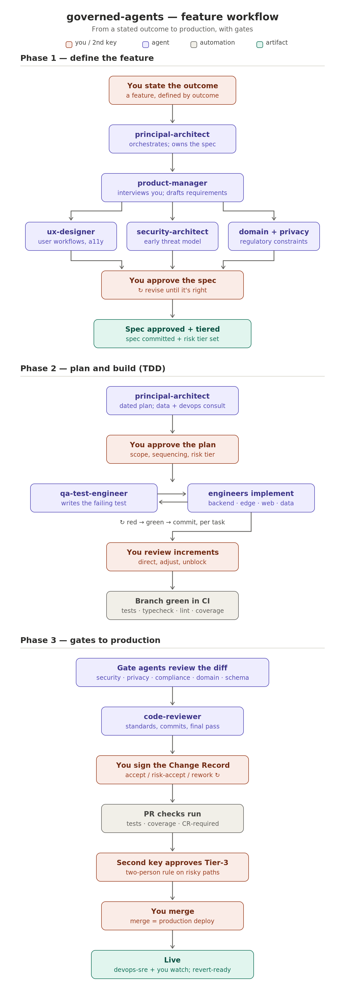

# development-team-agents

**A 23-agent AI development team for Claude Code — with the governance to trust it.**

Created by [Tom Hanks](https://tomhanks.pro) (BlackRaptor AI) ·
Battle-tested in production · Contact: **GitHub issues and discussions only**

Read [VISION.md](VISION.md) for why this exists and what makes it different.

You're a solo developer (or a tiny team) shipping straight to production with AI
agents doing much of the work. How do you make that *safe* — and *auditable* —
without pretending you're a 50-person org? This kit is one working answer,
extracted from a production platform where merge-to-main deploys directly to
production and one developer runs the whole show.

It is not just prompts. It's a three-layer operating model:

- **Agents advise** — 23 specialist personas (architect, engineers, security,
  privacy, compliance, QA, legal/IP, and more) that draft, build test-first,
  and review, coordinated by a process-only orchestrator.
- **Humans decide** — every sensitive change gets a signed **Change Record**:
  the agent's verdict is evidence, your decision is the control.
- **Machines enforce** — a fail-closed path-guard hook, a CI check that blocks
  gated changes without a Change Record, sparse CODEOWNERS for a real
  two-person rule on the dangerous few percent, and branch protection.



## What's in the box

```
agents/            23 agent templates ({{PLACEHOLDER}}-parameterized)
claude/            hooks (Tier-3 path guard), skills (incl. reference skills),
                   slash commands, settings
github/            change-record-required CI workflow, CODEOWNERS + PR templates
docs/              Change Record template, branch-protection checklist,
                   gate-enforcement map, agent-retro log, workflow diagram
agent-evals/       proactive agent-quality convention (pairs with agent-retros)
install.sh         one-command install into your repo
CUSTOMIZATION.md   the 30-minute adaptation guide
CHANGELOG.md       what changed, and credit to the ideas we borrowed
```

### The roster

| Pod | Agents |
|---|---|
| Orchestration & Architecture | `dev-orchestrator` (process-only orchestrator — the one agent that invokes others), `principal-architect` (architecture authority), `security-architect` |
| Product & Design | `product-manager`, `ux-designer` |
| Engineering | `backend-engineer`, `frontend-engineer`, `data-engineer`, `ai-ml-engineer`, `edge-agent-engineer` (on-device/customer-premises tier) |
| Quality & Assurance | `qa-test-engineer`, `code-reviewer`, `red-team-reviewer` (adversarial pre-pentest review) |
| Compliance | `compliance-officer`, `privacy-counsel`, `domain-compliance` (your regulated domain: HIPAA, SOX, MRV, …) |
| Operations | `devops-sre`, `security-operations` (runtime security: SIEM, WAF, IR), `operational-readiness` (fit-for-operation + human-in-the-loop) |
| Communication & GTM | `product-marketing`, `technical-writer` (spec/code-drift) |
| Legal & IP | `legal-docs-writer` (public legal/policy docs, prepare-never-file), `ip-counsel` (patentability research, disclosure packages, trademark/copyright prep) |

Six agents hold **blocking gates** (security, privacy, compliance, domain,
schema, human oversight of consequential automated actions). Gate agents output
Change-Record-ready verdicts: PASS / CONCERNS / FAIL. Overruling a FAIL forces
a written risk acceptance with a revisit date. `red-team-reviewer` is read-only
by design and **complements, never replaces, a human penetration test**. See
[CHANGELOG.md](CHANGELOG.md) for what's new and credit to the community ideas
behind it.

### Model tiering

Each agent's `model:` is a deliberate policy choice, not an accident. The knob
is **the cost of being wrong × the call volume**: pay for the strongest model
where a mistake is expensive and the agent runs rarely; use a strong-but-cheaper
model for high-volume execution.

| Tier | Model | Agents | Why |
|---|---|---|---|
| Orchestration & Architecture | `fable` | `dev-orchestrator`, `principal-architect` | `dev-orchestrator` routes every change and enforces the challenge discipline — a routing miss silently skips a gate. `principal-architect` shapes every architecture-level decision — the costliest kind to get wrong. Both merit the strongest model available. |
| Deep judgment (gates & adversarial review) | `opus` | `security-architect`, `privacy-counsel`, `compliance-officer`, `domain-compliance`, `red-team-reviewer`, `security-operations`, `code-reviewer`, `operational-readiness`, `legal-docs-writer`, `ip-counsel` | Blocking gates and adversarial passes: being wrong is expensive and call volume is low, so the premium is worth it. `code-reviewer` sits here deliberately — it is the last gate before a merge-to-prod deploy and runs once per PR, so the premium buys judgment at the single point where everything converges. |
| Everyday build | `sonnet` | `backend-engineer`, `frontend-engineer`, `data-engineer`, `ai-ml-engineer`, `edge-agent-engineer`, `qa-test-engineer`, `devops-sre`, `ux-designer`, `product-manager`, `product-marketing`, `technical-writer` | High-volume execution from already-approved specs; strong and cost-efficient. |

Two notes:

- **`data-engineer` stays on `sonnet` despite holding the Tier-3 schema gate** —
  a documented exception. Most of its calls are build work where `sonnet` is
  the right choice, and the schema gate's residual risk is backstopped by
  CODEOWNERS: Tier-3 schema paths require a second person's approval regardless
  of the agent's verdict. Revisit if a schema miss ever reaches your retro log.
- **The top tier is `fable` (Fable 5)** — the most capable model — reserved for
  `dev-orchestrator` and `principal-architect`, the two roles where a mistake is
  costliest and call volume is lowest, so the extra capability pays for itself
  first. If your environment doesn't have `fable`, fall back to `opus` for those
  two (change their `model:` frontmatter, or pass the model at invocation).

Adjust any of this to your own cost/quality tradeoff; the frontmatter `model:`
field is yours to set.

**Tier also sets output-quality discipline.** The model tier decides how hard
each agent runs the **Excellence Pass** (`claude/skills/excellence-pass`, drawn
from [`docs/agent-operating-standard.md`](docs/agent-operating-standard.md)) —
because the quality gap between tiers concentrates in five behaviors a strong
model does by default and a cheaper one skips unless told: enforce the hidden
input contract, verify by an *independent* method, add the decision-changing
second-order layer, draft (not describe) the interfaces the deliverable depends
on, and quantify the counterfactual. Each charter carries a one-line pointer
tuned to its tier — the top tier keeps latitude (checklist backstop); the
everyday-build tier runs it as an explicit checklist and lists three ways the
output could be wrong before delivering. That is how a strong model's default
behaviors are transferred to the rest of the roster: instructions can't
transfer capability, but they transfer the process.

### The orchestration model

There are three orchestration roles, and only one of them is an agent file you
invoke:

- **The master orchestrator is *you* — the human's live Claude session.** It is
  the single point of contact, the only cross-team router, and the place that
  can invoke any specialist directly for small, scoped work (Tier 1, no gated
  surface). It is not an agent file.
- **`dev-orchestrator`** is a **process-only** orchestrator. It holds the
  `Agent` tool for the dev team and runs the lifecycle of a change: it routes
  work with full context packets, convenes collaboration working sessions,
  enforces the challenge discipline on every claim (evidence + confidence label
  + falsifier), reconciles each plan against the standing blocking-gates table,
  and assembles the gate verdicts into the Change Record. It holds **no content
  authority** — it never designs, writes code, or issues a verdict, and it
  never overrides a specialist on substance. It is the dev-side mirror of the
  Council's orchestrator.
- **`principal-architect`** is the **architecture authority**, not the router.
  It authors design specs and owns the architecture standard (features
  incorporated rather than bolted on, integration-ready seams, secure-by-
  architecture, outcome fidelity), and its designs are challenged and
  gate-reviewed like any other specialist's work. (The `Agent` tool moved to
  `dev-orchestrator`: the author of a spec no longer routes the reviews of that
  spec — separation of duties.)

**Provisional agents.** When work has no chartered owner, an orchestrator may
commission a *provisional agent* from a written role brief for that task only:
least-privilege tools, full challenge discipline, and **never** a gate, a
blocking verdict, or a gated surface. Every use is reported to you with a
recommendation — formalize as a permanent agent, run once, or fold the duty
into an existing charter. The team grows only through your signature.

**The customer-experience north star.** The whole team builds toward one
outcome: the product does what customers need and want, it is easy to use, and
every feature works as expected, every time. Mechanically, every spec states
its customer outcome and every plan verifies the built feature against that
outcome — not merely against passing tests — and `dev-orchestrator` returns
specs and plans that arrive without it. Ease of use and security are
co-primary, never traded off: where they seem to conflict, the fix is to make
the secure path the easy path.

### The rules, in one paragraph

Changes are tiered: **Tier 1** (routine) merges on green CI. **Tier 2**
(touches a review gate) requires a full signed Change Record — CI blocks the
merge without one. **Tier 3** (auth, schema, remote execution, CI config, your
regulated domain) additionally requires a second person's code-owner approval,
and a local hook prevents agents from editing those paths at all. Trunk-based
delivery: short-lived branches, dark launches behind flags, expand/contract
migrations. When an agent misses something, the miss is logged and the agent's
definition is amended — the team is a set of coaching records, not static
prompts.

## Quickstart

```bash
git clone https://github.com/BlackRaptorAI/BlackRaptor_Agents/tree/main/development
cd development-team-agents
./install.sh /path/to/your/repo
```

Then spend ~30 minutes with [CUSTOMIZATION.md](CUSTOMIZATION.md): fill the
placeholders (your stack, your Tier-3 paths, your second approver), delete the
agents you don't need, and run the verification tests in
[docs/branch-protection-checklist.md](docs/branch-protection-checklist.md).

Daily driving, from your repo root:

```
claude
> /new-feature customers can export their billing history
> /gate-review
> /pre-merge
```

## Honest limitations

This kit practices what it preaches, so here's its own CONCERNS verdict:

- The local hook is a **seatbelt, not a wall** — a determined actor can bypass
  it. Server-side controls (CI + CODEOWNERS + branch protection) are the real
  enforcement; the hook catches accidents.
- Agent verdicts are only as good as the model and the context you give them.
  The Change Record exists precisely because a human must stay accountable.
- The solo-mode design (0 blanket approvals + code-owner-only review) depends
  on GitHub branch-protection behavior — **run the three verification tests**
  before trusting it.
- Compliance framing (SOC 2-style compensating controls) is a design pattern,
  not legal advice. Confirm with your auditor.

## Companion project: the Executive Advisory Council

development-team-agents answers *"are we building the thing right?"* Its companion,
**[BlackRaptor Agents — council](https://github.com/BlackRaptorAI/BlackRaptor_Agents/tree/main/council)**,
answers the question upstream of it: *"are we building the right company?"* —
twelve tough, evidence-driven advisor seats (product, market, pricing,
finance, GTM, revenue, growth, technology & data, people, ethics & legal,
fundraising) convened by an orchestrator that challenges every input before
it reaches you.

The two teams connect through one artifact: the Council's **Definition
Brief** — problem, customer, measurable outcome, pricing direction, scope,
constraint envelope, and human-oversight requirements — which this kit's
`product-manager` and `principal-architect` turn into requirements, spec,
and architecture. Same operating philosophy (advise → decide → enforce,
preserved dissent, a human signs), same license, same authors.

## Contributing

The most valuable contribution is an **agent miss**: your agent said PASS,
something shipped broken, and you amended the persona so it won't happen again.
PR the amendment with the story. See [CONTRIBUTING.md](CONTRIBUTING.md) for
that and the other ways to help (new role agents, gate improvements, domain
adaptations — someone should build the HIPAA variant).

Adapted this for your stack or domain? Open a Show-and-tell Discussion — we
keep a list of adaptations.

## License

Apache-2.0 © 2026 Tom Hanks / BlackRaptor AI. See [LICENSE](LICENSE) and [NOTICE](NOTICE).
Created by Tom Hanks (BlackRaptor AI), battle-tested in production.
Keep the NOTICE, this attribution, and a link back to the source repository with
any copy, port, or derivative (Apache 2.0, §4d). Contact: GitHub only.
